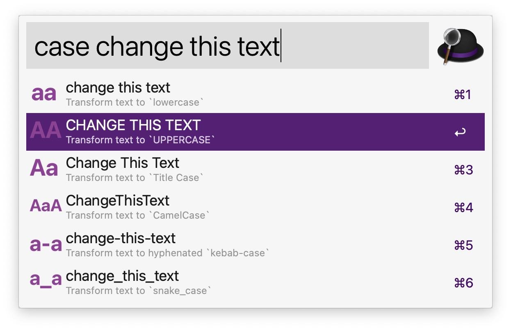

# Change Case — Alfred Workflow (Swift Edition)

**A spiritual successor to the original Change Case workflow**

This Swift rewrite is intended to continue the legacy of the original Python-based Change Case workflow, which is no longer supported in recent macOS versions. 

## About This Fork

This fork completely reimplements the workflow in Swift to ensure:
- Native compatibility with all modern macOS versions without dependencies
- Preservation of the original's simplicity and ease of extension
- Enhanced functionality with new transformation types
- Longevity through using macOS's built-in Swift support

## Usage

**Recommended Method**: Select text in any application and use the assigned hotkey (default: CMD+SHIFT+T) to transform it. To assign a global hotkey, view Change Case in Alfred's Workflow editor and double-click the Hotkey node.

Alternatively, use the keyword `case` to launch the workflow with the contents of the clipboard. All transformation styles will be previewed as Alfred results. Select one to copy it to the clipboard and paste into the current application.

You can also type text directly after the `case` keyword to transform that specific text instead of using clipboard content.

## Available Transformations

- **lowercase**: converts text to all lowercase
- **UPPERCASE**: converts text to all uppercase
- **Title Case**: capitalizes the first letter of each word (note: Swift's built-in capitalization is more basic than the original Python implementation and doesn't handle special cases as well)
- **CamelCase**: removes spaces and capitalizes first letter of each word
- **kebab-case**: lowercase with hyphens between words
- **snake_case**: lowercase with underscores between words
- **dots.separated**: replaces spaces, hyphens, and underscores with dots
- **terraform-naming**: follows Terraform resource naming conventions (replaces dots with hyphens, adds underscore prefix if starting with a number)

## Adding Your Own Transformations

This workflow is designed to be easily extended. To add your own transformation:

1. Open `changecase.swift` in a text editor
2. Add a new transformation function (see existing functions as examples)
3. Update the `main()` function to include your new transformation
4. Add a corresponding icon in the workflow folder

The workflow will automatically detect changes to the Swift file and recompile it when needed (you may need to run the workflow twice for changes to take effect). Manual compilation is not required for the workflow to function.

## Compilation & Testing

- Compile: `swiftc changecase.swift -o changecase`
- Run: `./changecase "Your Text Here"`
- Run tests: `swift changecase_with_tests.swift --test`

## Version History

### 4/29/2024 - 2.0

- Complete rewrite in Swift for native macOS compatibility
- Added two new transformations: dots.separated and terraform-naming
- Simplified codebase for easier maintenance and extension
- Added proper unit tests using XCTest
- **Known limitation:** Title Case functionality is simpler than the original Python implementation as it uses Swift's built-in capitalization, which doesn't handle special cases as well as the Python titlecase module. Previous test suite for Title Case is currently failing. 

### Previous Versions

See [release history](https://github.com/gillibrand/alfred-change-case/releases) of the original repository.

## Credits

- Original workflow by Jay Gillibrand
- Swift rewrite by Alejandro Scandroli
- Original `CamelCase`, `kebab-case`, and `snake_case` additions by Ben Wagner

## ...
> [Check out my other workflows and my workflow design principles.](https://github.com/ascandroli/alfred-workflows)
